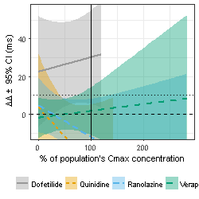
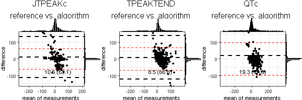

# Impact of filtering (or not) the ECG signal before T-wave delineation

The first step of the T-wave delineator is to filter the signal. However, it is also possible to compile ecglib and run the T-wave delineator example without a signal processing library installed (see line 60 in [twaveDelineator.cpp](../ecglib/src/delineators/twave/ecglib/delineator/twave/twaveDelineator.cpp)). Runing the example and/or the T-wave delineator algorithm without the proper filtering results in spurious annotations. Thus, we have updated the examples directory with a filter library to allow others who do not have a C++ signal processing library available to filter the signal before calling the T-wave delineator. This document shows a summary of results you can obtain running the full set of analysis scripts as described in [HOWTO.md](HOWTO.md) file in the [examples](../examples) directory. It illustrates the importance of filtering the signal and its effects in the annotations and subsequent results.

## Annotations from filtered vs. no-filtered ECG signal

Figure below shows the vector magnitude lead (VCGMAG) of record *ecgrdvq/medians/1005/643ee40b-9432-4dbc-9e67-a191c14c4843* and the reference annotations (dashed vertical lines) vs. the fully automatic annotations (solid vertical lines) obtained without filtering the signal (left column panels) and filtering the signal (right column panel). Middle row plots show the first derivative of the VCGMAG lead in yellow (scaled by 50 fold), and the bottom row zoomed-in snippets of the T-wave area of the corresponding ECG signals. The table below shows the annotation values for the reference, the filtered and non-filtered signal delineations. The small noise in the first derivative of the no-filtered VCGMAG causes spurious zero crossings that result in misplaced Tpeak and Tend annotations.

| Annotations source | QON | QOFF | TPEAK | TPPEAK | TEND |
|--------------------|:---:|:----:|:-----:|:------:|:----:|
|Filter disabled     | 302 | 391  |  607  | -      | 750  |
|Filter enabled      | 302 | 391  |  620  | -      | 728  |
|Reference           | 302 | 391  |  619  | -      | 732  |

## Exposure-response plots for J-Tpeakc

The spurious and misplaced Tpeak and Tend annotations obtained when non filtering the signal properly result in erroneous results. For example, plots below reproduce exposure-response plot in [Figure 3.K](https://www.ncbi.nlm.nih.gov/pmc/articles/PMC4579946/figure/fig03/) in [Vicente et. al JAHA 2015](https://doi.org/10.1161/JAHA.114.001615). Left panel shows incorrect results from annotations obtained without filtering the ECG. Right panel shows exposure-response model from annotations obtained with the proper filter applied to the ECG before calling the T-wave delineator. Note that right pannel reproduces [Figure 3.k](https://www.ncbi.nlm.nih.gov/pmc/articles/PMC4579946/figure/fig03/) in [Vicente et. al JAHA 2015](https://doi.org/10.1161/JAHA.114.001615)

| Filter disabled | Filter enabled |
|:---------------:|:--------------:|
|||

## Bland-Altman plots of changes from baseline

Filtering the signal reproduces the results reported in [Johannesen et al PLoS One 2016](https://www.ncbi.nlm.nih.gov/pmc/articles/PMC5201230/). However, not filtering the ECG does not reproduce the semi-automatic (reference) annotations. Figures below reproduce [Figure 3](https://www.ncbi.nlm.nih.gov/pmc/articles/PMC5201230/figure/pone.0166925.g003/) in [Johannesen et al PLoS One 2016](https://www.ncbi.nlm.nih.gov/pmc/articles/PMC5201230/) for annotations from no-filtered (top) and filtered ECG signals (bottom), where red dashed lines show the standard deviation and the dashed black lines the 95% condifence intervals.

|      |            |
|:-----|:----------:|
|Filter disabled ||
| Filter enabled||

## LICENSE

These examples source code is in the public domain within the United States, and copyright and related rights in the work worldwide are waived through the CC0 1.0 Universal Public Domain Dedication. These examples are distributed in the hope that it will be useful, but WITHOUT ANY WARRANTY; without even the implied warranty of MERCHANTABILITY or FITNESS FOR A PARTICULAR PURPOSE. See DISCLAIMER section below, https://github.com/FDA/ecglib/, https://creativecommons.org/publicdomain/zero/1.0/ and https://www.gnu.org/licenses/gpl-faq.html for more details.
 
## DISCLAIMER

FDA assumes no responsibility whatsoever for use by other parties of the Software, its source code, documentation or compiled executables, and makes no guarantees, expressed or implied, about its quality, reliability, or any other characteristic.  Further, FDA makes no representations that the use of the Software will not infringe any patent or proprietary rights of third parties.   The use of this code in no way implies endorsement by the FDA or confers any advantage in regulatory decisions.

## REFERENCES

1. Johannesen L, Vicente J, Hosseini M, Strauss DG. [Automated Algorithm for J-Tpeak and Tpeak-Tend Assessment of Drug-Induced Proarrhythmia Risk](https://www.ncbi.nlm.nih.gov/pmc/articles/PMC5201230/). PLoS One. 2016; 11(12): e0166925. doi: 10.1371/journal.pone.0166925.
2. Vicente J, Johannesen L, Mason JW, Crumb WJ, Pueyo E, Stockbridge N, Strauss DG. [Comprehensive T wave morphology assessment in a randomized clinical study of dofetilide, quinidine, ranolazine, and verapamil](http://www.ncbi.nlm.nih.gov/pubmed/25870186).doi: 10.1161/JAHA.114.001615.

